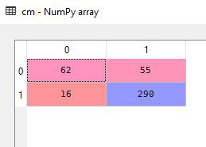

# Global-Warming-Tweet-Analysis

## Overview
The following analysis has been conducted on tweets regarding the different issues related to global warming. The data set comprises of the tweets and the categorical data pertaining to the  existence of those issues in reality.The features of the data set are as follows: 
* ##### Data Set Characteristics : Multivariate
* ##### Number of instances : 6090
* ##### Missing Values : Yes
* ##### Associated Tasks : Natural Language Processing, Classification

## Built With
* ###### Python
* ###### Numpy
* ###### Pandas
* ###### Scikit Learn
* ###### Porter Stemmer
* ###### Natural Language Tool Kit (NLTK)

## Results
#### The confusion matrix obtained after the analysis

##### The result has been obtained using the Random Forest Classification technique but other classification models may be used in order to achieve a different accuracy.

## Author
   Srinjoy Saha
